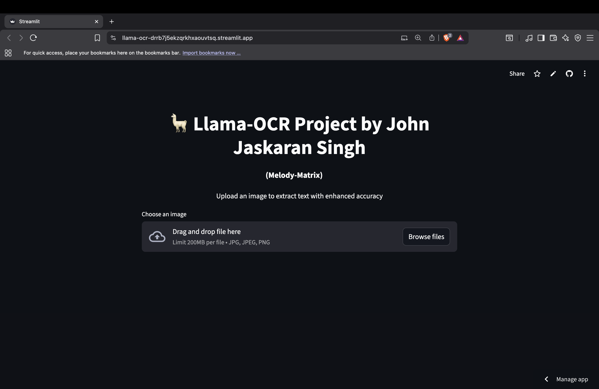

# 🦙 Llama-OCR

A simple OCR app built with EasyOCR and Streamlit. Upload an image and extract text instantly, with confidence scores and optional enhancements.

🔗 **Live App**: [Try it here](https://llama-ocr-drrb7j5ekzqrkhxaouvtsq.streamlit.app)

🧠 Built by **John Jaskaran Singh**

---

## 📸 Screenshot

 <!-- Replace with your actual image filename -->

---

## 🚀 Features

- Upload PNG, JPG, or JPEG images (up to 200MB)
- Optional brightness & contrast enhancement
- Confidence scores for each detected line
- Full text output in a scrollable box
- Clean, responsive layout with centered image preview

Update README with app link and features
